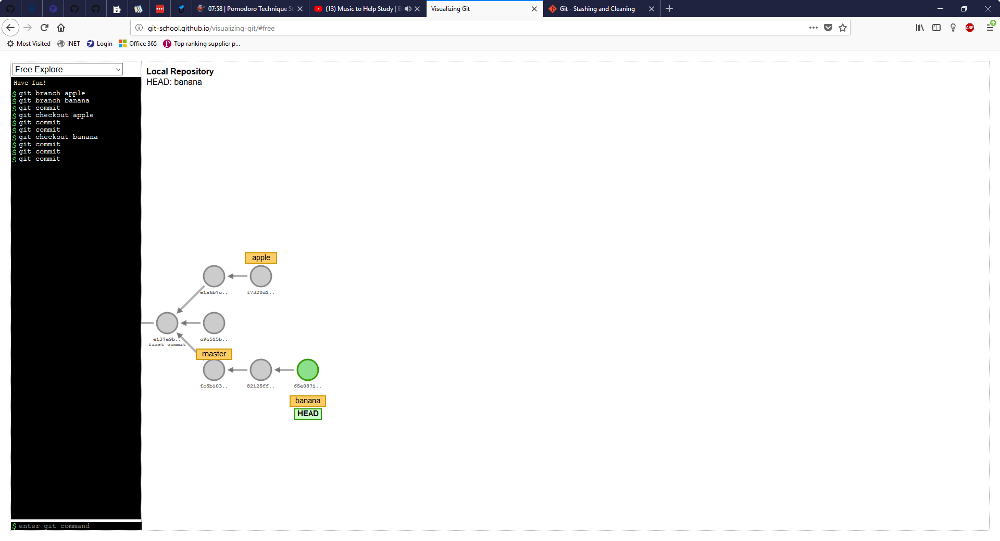
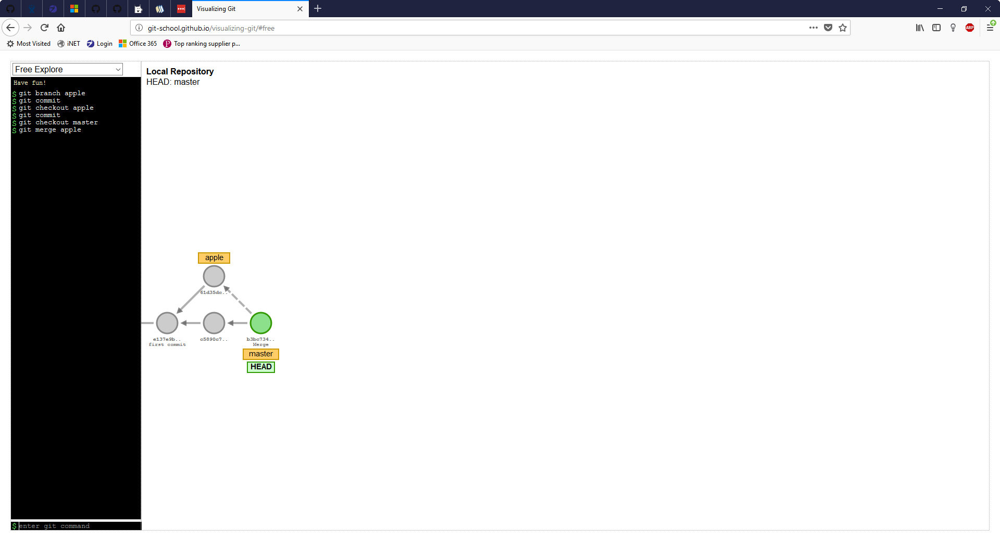
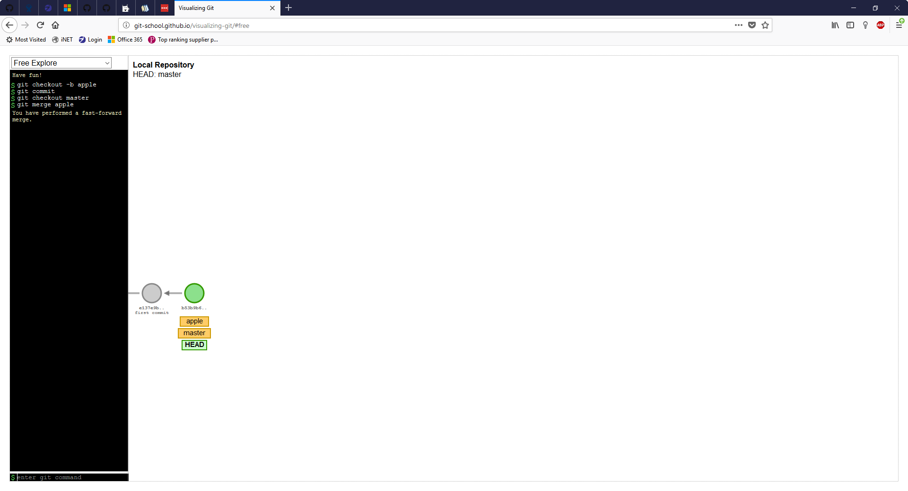
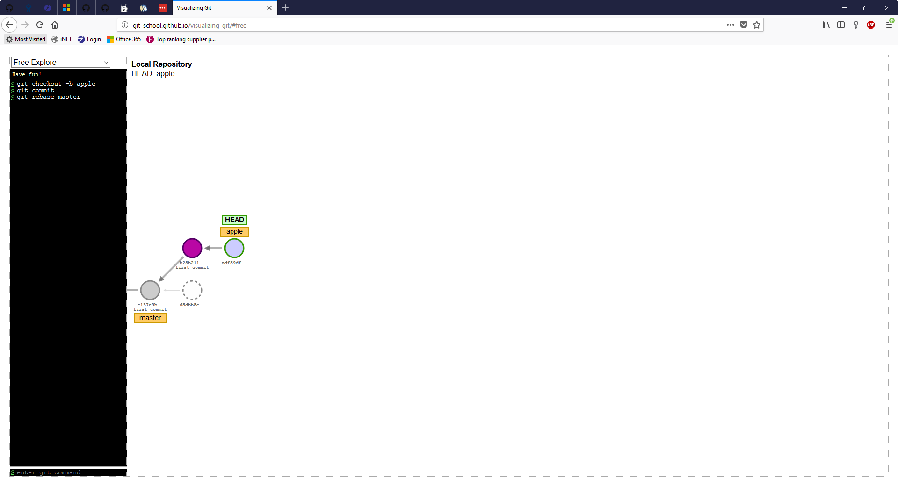
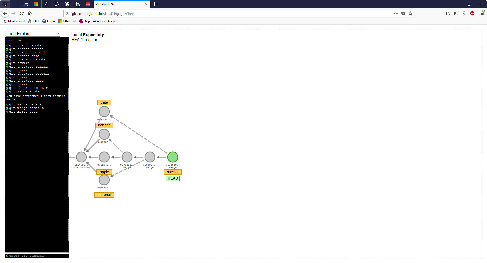
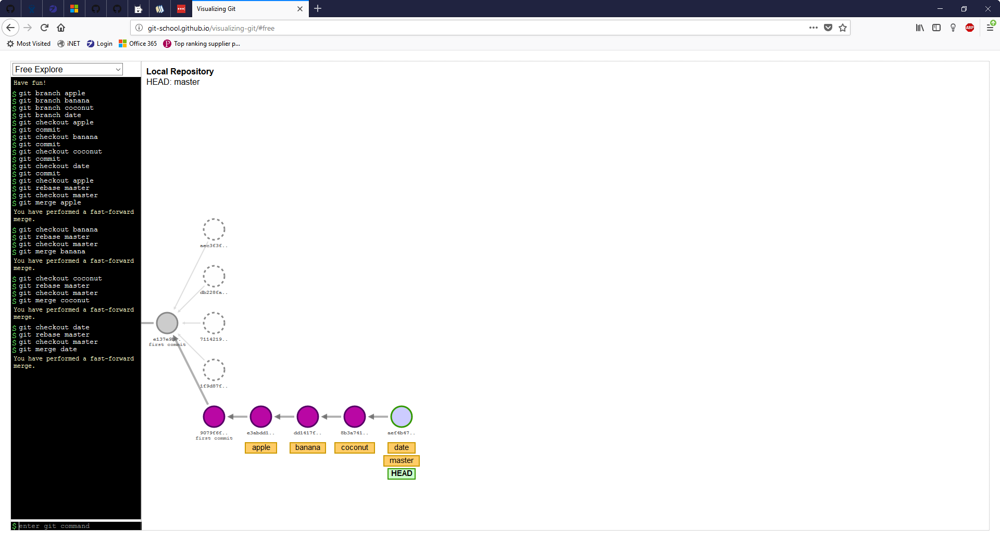

# Lets learn some git!

## What you'll learn

1. What is branching?
    1. What is merge?
    2. What is rebase?
<!-- 4. What is pulling? -->
<!-- 5. What is stashing? -->

---

## Branching

Branching is the way we split history while using git, as well as most other [RCS](https://en.wikipedia.org/wiki/Revision_Control_System)'s.
Below is an example of how to represent branching.

Now, why should you use branching?
Branching developed as a solution to developers disrupting one another during mid-development.
So, if you are working on a project with other developers, you may want to use branches for individual features.

You can probably see the problem that branching introduces.
How do we mix our changes back together after we finish our features independently?
With git, we can solve this problem in two main ways; merging, and rebasing!

### Merging

Merging is the first way to combine histories.
Below are a couple examples of how it might look.

The first example is a more traditional a merge.
You get a new commit that has two parents instead of one.

Now, the second example is something called a fast-forward merge.
You can think of it as a special case of merging.
It only happens if the history can be merged without two parents.
It will be important to understand while working with rebase.

### Rebasing

Rebasing is the other way of combining histories.
It involves "moving" all of the commits that happened on a branch onto the top of another branch.
Below is an example of this happening.

As you can see, the commit where the branch used to be has been orphaned with a copy of that commit after master.
Something important to note, after the rebase, the branch rebased onto does not advance onto the rebased commits.
Because of this you have to merge the branches manually.
Don't worry though, if you do it right away you will get a fast forward merge like I was talking about earlier.

#### Which one should I use?

During all this you may have been asking, which one should I use?

_Technically correct short answer, it depends!_

For a more in-depth answer you need to understand the trade-offs between them.
The main trade-off between them is how correct your history is versus how complex your history is.
I'll allow these images to demonstrate my point.

As you can see, the first example which uses merging alone is more complex.
With that said, it is also more correct in the sense of how the project actually evolved.

Now for the rebasing example.
It has a much simpler history, at a cost of the merge history.
